---

### 👨‍🚀 About Me

- 🎓 I am studying **Computer Science and Engineering** at **UBT University** in Kosovo.
- 🚀 I develop software and design websites.
- 🌱 I am currently improving my skills in new technologies and algorithms.
- 💬 You can use the links below to get in touch with me.
 

### 🛠️Technologies I Use

  

 

### 📊 GitHub Statistics

  
  

 

  

 

### 🐍 Contribution Snake

  <picture>
    <source media="(prefers-color-scheme: dark)" srcset="https://raw.githubusercontent.com/pelopsis/pelopsis/output/github-contribution-grid-snake-dark.svg" />
    <source media="(prefers-color-scheme: light)" srcset="https://raw.githubusercontent.com/pelopsis/pelopsis/output/github-contribution-grid-snake.svg" />
    
  </picture>

 

### 🌐social

  
  
  

